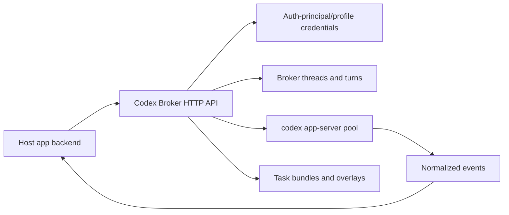

# Codex Broker

Codex Broker is an internal HTTP service you run next to a product app that needs Codex. It keeps the app backend from managing Codex auth homes, `codex app-server` children, thread mappings, same-thread locks, and event streams itself.

The usual deployment is one broker container beside one host app. The host app handles product behavior. The broker handles Codex runtime plumbing.

## Broker responsibilities

The broker handles:

- per-user and per-Codex-auth-profile `CODEX_HOME` directories
- Codex auth status, active probes, device auth, API-key auth, runtime invalidation, and logout
- long-lived `codex app-server` child processes and process pooling
- broker threads, turns, same-thread locking, steering, interruption, and archive behavior
- normalized event persistence and Server-Sent Events streaming
- configuration profiles for model, sandbox, approval, workspace, and bundle policy
- mounted bundles, inline bundle validation, skills, prompts, MCP servers, and broker-hosted tool adapters
- readiness checks, audit logs, metrics, structured logs, and restart recovery

The host app keeps users, product authorization, database records, UI state, prompt construction, evidence behavior, files, queues, artifacts, and app-specific tool semantics.

## Runtime loop

Most integrations use this flow:

1. The host authenticates its own user.
2. The host chooses an `ownerId`, which owns broker state and audits.
3. Trusted policy resolves the auth principal, defaulting it to the owner.
4. The host checks or starts Codex auth for that principal/profile.
5. The host creates a broker thread that immutably binds the principal and profile.
6. The host submits turns and streams normalized events from `/events`.
7. The host maps those events into its own UI, job logs, database rows, or artifacts.

## When it fits

Use the broker when a product app needs Codex but should not run Codex process management in its own chat route or worker.

- Live chat: the app keeps chat state, UI streaming, and product tools while the broker serializes Codex turns.
- Background jobs: the worker keeps queue records, artifacts, and review state while the broker runs Codex through a durable thread and turn API.
- Per-user Codex auth: each product user or service account gets isolated Codex credentials under a broker-managed user/Codex-profile home.
- Reusable bundles: reviewed manifests expose skills, prompts, MCP servers, and broker-hosted HTTP adapters without moving product logic into the broker.

## Reader paths

New integrators: start with [Quickstart](quickstart.mdx), then read [Core concepts](concepts.mdx), [Host integration](integrations/host-integration.mdx), and [HTTP flow](integrations/http-flow.mdx).

Operators: read [Deployment](operations/deployment.mdx), [Configuration reference](operations/configuration-reference.mdx), and [Architecture](runtime/architecture.mdx).

Bundle authors: read [Bundles and hosted tools](bundles/bundles-and-hosted-tools.mdx).

API consumers: read [API overview](reference/api.mdx), then use the generated API reference in the Reference tab.
